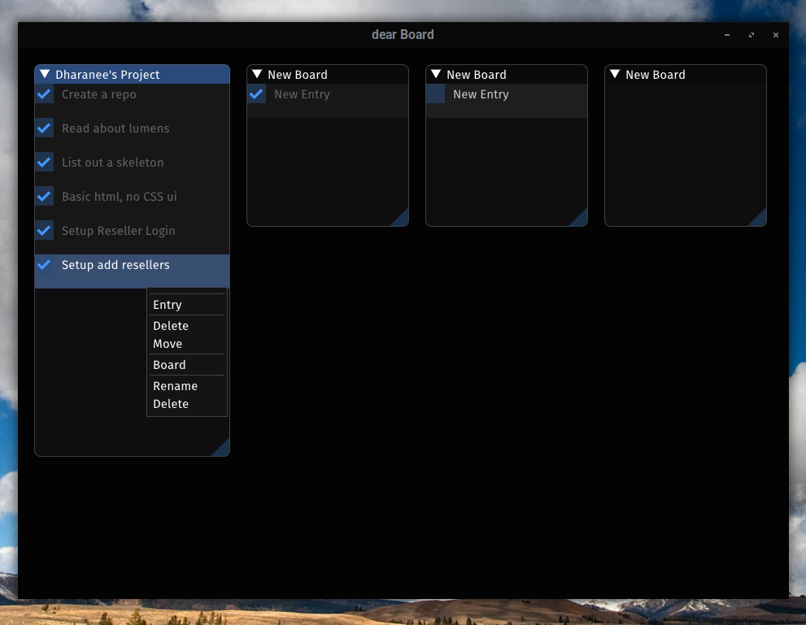

# dear Board
##### Version: 0.9

A minimalist kanban board app written in C++, 
to keep track of my projects and todos.

### Dependencies: 
* OpenGL2
* GLFW

## Build Instructions
Run `make`

## License
http://unlicense.org/

## Feature requests, bug reports
If you find any bugs or have any features that you like to see implemented,
please open an issue or pull request.

## Acknowledgements
Omar Cornut ([github](https://github.com/ocornut), [website](http://www.miracleworld.net/))
for the lightweight yet productive [dear ImGui](https://github.com/ocornut/imgui/) library.

